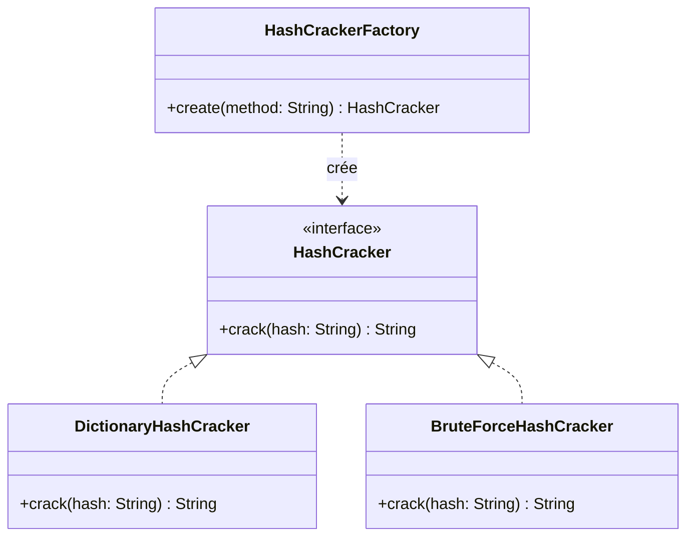

## 1. Introduction

Ce projet, **PasswordCracker v1**, est développé dans le cadre d'un
mini-projet visant à mettre en pratique le patron de conception créationnel
*Simple Factory*. L'outil simule une opération d'audit de sécurité : à
partir d'un hash MD5, il tente de retrouver le mot de passe en clair qui lui
correspond, en utilisant l'une de deux méthodes de cassage sélectionnables
en ligne de commande (dictionnaire ou force brute).

Au-delà de la fonctionnalité elle-même, l'objectif pédagogique principal est
de concevoir une architecture orientée objet modulaire : chaque méthode de
cassage est isolée dans sa propre classe, interchangeable via une interface
commune, et instanciée par une fabrique centralisée plutôt que directement
dans le programme principal.

## 2. Présentation du problème

Dans le domaine de la cybersécurité, les mots de passe ne sont
généralement pas stockés en clair dans les bases de données : ils sont
transformés par une fonction de hachage cryptographique (ici, MD5). Lors
d'un audit de sécurité, il est courant de devoir évaluer la robustesse des
mots de passe utilisés, ce qui implique de tenter de retrouver un mot de
passe à partir de son empreinte.

Deux approches classiques permettent cela :

- **l'attaque par dictionnaire**, qui teste une liste de mots courants ou
  probables (rapide, mais limitée aux mots présents dans la liste) ;
- **l'attaque par force brute**, qui teste systématiquement toutes les
  combinaisons possibles d'un alphabet donné jusqu'à une longueur maximale
  (exhaustive, mais coûteuse en temps).

Le défi de conception posé par ce projet n'est pas seulement de faire
fonctionner ces deux attaques, mais de les intégrer dans une architecture
qui respecte les contraintes suivantes :

- les classes concrètes de cassage ne doivent jamais être instanciées
  directement dans le programme principal ;
- la création des objets doit être centralisée dans une fabrique unique ;
- l'ajout futur d'une nouvelle stratégie ne doit pas nécessiter de dupliquer
  du code.

C'est cette dernière contrainte qui motive l'utilisation du patron
**Simple Factory** : elle permet de découpler le programme principal des
implémentations concrètes, en ne dépendant que de l'interface commune
`HashCracker` et de la fabrique `HashCrackerFactory`.
## 3. Architecture

Le projet suit une architecture en couches simples, organisée autour du
patron créationnel **Simple Factory** :

- **Interface `HashCracker`** — le contrat commun (`crack(hash): String`)
  que toute stratégie de cassage doit respecter.
- **Stratégies concrètes** — `DictionaryHashCracker` (attaque par
  dictionnaire) et `BruteForceHashCracker` (attaque par force brute),
  chacune implémentant `HashCracker` de façon indépendante.
- **`HashUtils`** — classe utilitaire statique centralisant le calcul du
  hash MD5, réutilisée par les deux stratégies pour éviter toute
  duplication de code.
- **`HashCrackerFactory`** — fabrique unique responsable de l'instanciation
  de la bonne stratégie (`DICO` ou `BRUTE`) à partir d'un simple identifiant
  textuel. C'est le seul point du programme où les classes concrètes sont
  instanciées.
- **Application console (`Main`)** — point d'entrée qui lit les arguments
  `-m` (méthode) et `-h` (hash), délègue la création de la stratégie à
  `HashCrackerFactory`, appelle `crack(hash)`, puis affiche le résultat.

Le principe directeur de cette architecture est le **découplage** : le
`Main` ne connaît que l'interface `HashCracker` et la fabrique — jamais les
classes concrètes. Cela permet de faire varier l'algorithme de cassage
sans toucher au code appelant, et illustre concrètement le rôle d'une
fabrique dans une conception orientée objet.

## 4. Diagramme UML



- `HashCracker` définit uniquement le contrat (`crack`), sans logique.
- `DictionaryHashCracker` et `BruteForceHashCracker` **réalisent** cette
  interface, chacune avec sa propre implémentation.
- `HashCrackerFactory` **dépend** de `HashCracker` (elle sait créer des
  objets de ce type) sans dépendre d'aucune classe concrète directement
  dans le reste du programme.

*(Version PlantUML disponible dans `diagramme.puml`.)*

## 5. Usage du patron Simple Factory

Le patron **Simple Factory** est utilisé pour centraliser la création des
objets `HashCracker` dans une seule méthode statique :

```java
public class HashCrackerFactory {
    public static HashCracker create(String method) {
        switch (method) {
            case "DICO":
                return new DictionaryHashCracker("dictionnaire.txt");
            case "BRUTE":
                return new BruteForceHashCracker();
            default:
                throw new IllegalArgumentException("Méthode inconnue : " + method);
        }
    }
}
```

Cela permet au programme principal d'écrire simplement :

```java
HashCracker cracker = HashCrackerFactory.create(method);
String result = cracker.crack(hash);
```

sans jamais écrire `new DictionaryHashCracker(...)` ou
`new BruteForceHashCracker()` en dehors de la fabrique. L'avantage
principal est le découplage entre le code appelant et les implémentations
concrètes : si une stratégie change en interne, ou si son constructeur
évolue, seul `HashCrackerFactory` doit être modifié.

## 6. Résultats obtenus

### Tests unitaires par stratégie

Les stratégies ont été validées isolément avant intégration (voir
`resultats_tests_personne2.md` et `resultats_tests_personne3.md` pour le
détail complet) :

| Stratégie | Cas testés | Résultat |
|---|---|---|
| Dictionnaire | 6 cas (mots présents, absents, dictionnaire manquant) | 6/6 réussis |
| Force brute | Mots de 1, 2 et 4 caractères + hash inexistant | 4/4 réussis, comportement conforme à l'espace de recherche théorique (26 + 26² + 26³ + 26⁴ = 475 254 combinaisons max) |

### Tests bout en bout (CLI complète)
$ java PasswordCracker -m BRUTE -h 098f6bcd4621d373cade4e832627b4f6
Password found: test
$ java PasswordCracker -m DICO -h 098f6bcd4621d373cade4e832627b4f6
Password found: test
$ java PasswordCracker -m DICO -h e7247759c1633c0f9f1485f3690294a9
Password not found
$ java PasswordCracker -m BRUTE -h e7247759c1633c0f9f1485f3690294a9
Password not found
java PasswordCracker -m DICO  098f6bcd4621d373cade4e832627b4f6
Usage incorrect 
```
## 7. Difficultés rencontrées
- **Explosion combinatoire de la force brute** : le nombre de tentatives
  croît exponentiellement avec la longueur (26⁴ ≈ 456 976 combinaisons pour
  4 caractères), ce qui rend le pire cas (mot non trouvé) sensiblement plus
  lent que l'attaque par dictionnaire — un compromis à documenter plutôt
  qu'à "corriger" dans cette v1.
- **Respect strict de la contrainte "pas d'instanciation directe"** : il a
  fallu vérifier que ni le `Main`, ni aucune classe autre que
  `HashCrackerFactory`, n'utilisent `new DictionaryHashCracker(...)` ou
  `new BruteForceHashCracker()`.

## 8. Conclusion

Ce mini-projet a permis de mettre en pratique le patron **Simple Factory**
dans un contexte concret : la création de deux stratégies de cassage de mot
de passe interchangeables via une interface commune (`HashCracker`) et une
fabrique centralisée (`HashCrackerFactory`). L'architecture obtenue est
modulaire, sans duplication de code, et respecte les contraintes imposées
par le sujet (aucune instanciation directe des classes concrètes en dehors
de la fabrique).


