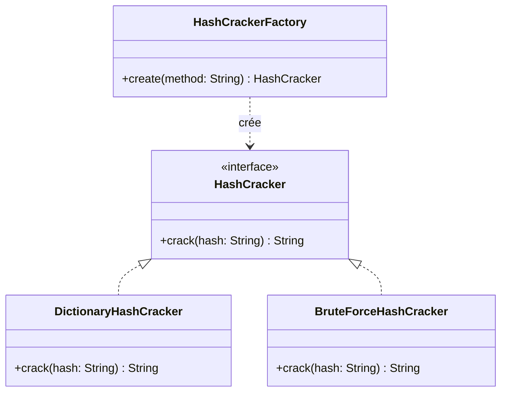

# Diagramme UML — PasswordCracker v1

Ce diagramme peut être collé tel quel dans le README du dépôt : GitHub affiche
nativement les blocs de code ```mermaid.



## Lecture du diagramme

- `HashCracker` est une interface : elle ne définit qu'un contrat (`crack`),
  aucune implémentation.
- `DictionaryHashCracker` et `BruteForceHashCracker` **réalisent** cette
  interface (flèche en pointillés avec triangle creux) : chacune fournit sa
  propre implémentation de `crack`.
- `HashCrackerFactory` a une dépendance vers `HashCracker` (flèche en
  pointillés simple) : elle sait **créer** des objets de ce type, mais ne les
  possède pas et ne dépend d'aucune classe concrète directement.
- Le programme principal ne dépend, lui, que de `HashCrackerFactory` et de
  l'interface `HashCracker` — jamais des classes concrètes.
# le code plantuml du diagramme se trouve dans le fichier "diagramme.puml"